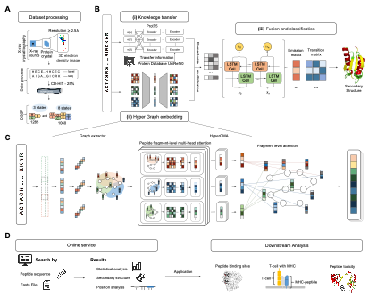

## Explainable deep hypergraph learning modeling the peptide secondary structure prediction
#### Accurately predicting peptide secondary structures remains a challenging task due to the lack of discriminative information in short peptides. In this study, we propose PHAT, a deep graph learning framework for the prediction of peptide secondary structures. The framework includes a novel interpretable deep hypergraph multi-head attention network that uses residue-based reasoning for structure prediction. Our algorithm can incorporate sequential semantic information from large-scale biological corpus and structural semantic information from multi-scale structural segmentation, leading to better accuracy and interpretability even with extremely short peptides. Our interpretable models are able to highlight the reasoning of structural feature representations and the classification of secondary substructures. We further demonstrate the importance of secondary structures in peptide tertiary structure reconstruction and downstream functional analysis, highlighting the versatility of our models. To facilitate the use of our model, we establish an online server which is accessible via http://inner.wei-group.net/PHAT/. We expect our work to assist in the design of functional peptides and contribute to the advancement of structural biology research.
#### 
##### (A) Dataset processing. We extracted the benchmark datasets from SCRATCH-1D, where the protein and peptide structures were derived with X-ray crystallography and operated with a resolution of at least 2.5 angstroms, for three-state and eight-state secondary structures. 
##### (B) Framework of PHAT. The framework consists of three modules: (i) Knowledge transfer module, (ii) Hyper Graph embedding module, and (iii) Fusion and classification module. In Knowledge transfer module, the original sequences are encoded by a pretrained protein model to gain the features of peptide residues. In Hyper Graph embedding module, the peptide sequences are constructed into hypergraph structures and embedded by HyperGMA. In Fusion and classification module, the outputs of Knowledge transfer module and the Hyper Graph embedding module are firstly fused through the element-wise multiplication and better integrated by the Bi-LSTM. Then the output of Bi-LSTM is inputted into the CRF layer, and as a result, the secondary structure of related residues can be predicted. 
##### (C) illustrates the details of Hyper Graph embedding module. In the part of graph extractor, peptide sequences are firstly sliced into fragments with specific length and constructed as hyperedges of the hypergraph structure. Then the hyperedges are cut into residue groups to be built as hypernodes in the hypergraph structure. Next, the hypergraph structure from graph extractor is inputted into HyperGMA to capture the multi-scale relationships in view of residue groups and peptide fragments by the multi-scale attention mechanism. 
##### (D) Online service. Our web server of PHAT is freely available to provide researchers with peptide details in three-state or eight-state secondary structures, statistical analysis, and position analysis. The predictions of our model can be applied in many downstream tasks as in Downstream Analysis.

#### We provide a <a href="https://github.com/jiangyi01/PHAT/blob/main/Tutorial_Install.ipynb">tutorial</a>, which includes details for the quick start of our method, the training environment, and downstream task pipelines, for using and reproducing our method easily.